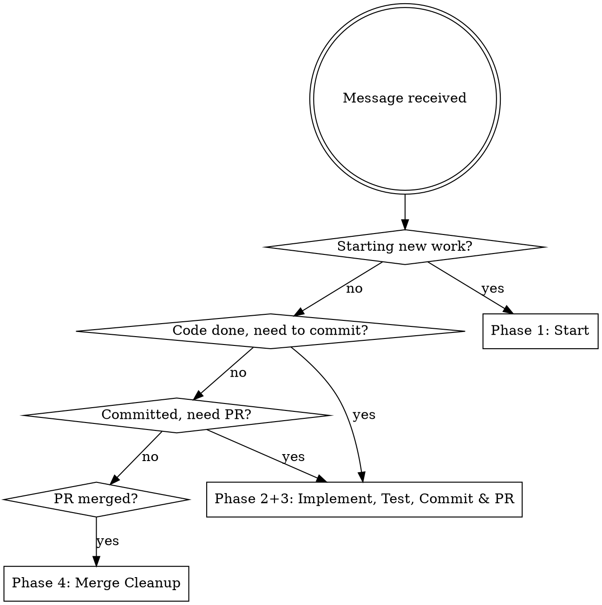

# shakuhachi-ro Dev Workflow

**This skill supersedes `superpowers:finishing-a-development-branch` and any generic commit/PR skill.** When this skill applies, do not fall back to generic patterns. CLAUDE.md always wins over skill defaults.

## Trigger Words

Invoke this skill when the user's message contains any of:

- **Starting work:** "start", "work on", "implement", "fix", "let's do", "pick up", "next task", "begin"
- **Commit phase:** "commit", "stage", "ready to commit"
- **PR phase:** "PR", "pull request", "create PR", "open PR", "push"
- **Merge/cleanup phase:** "merge", "merged", "done", "finish", "clean up branch", "delete branch"

## Phase Router

Identify the current phase before acting:



## Full Workflow

```dot
digraph dev_workflow {
  "Task assigned" [shape=doublecircle];
  "Check branch" [shape=box];
  "On main?" [shape=diamond];
  "Create feature branch" [shape=box];
  "Verify task in code" [shape=box];
  "Already done?" [shape=diamond];
  "Mark done, move on" [shape=box];
  "Make changes" [shape=box];
  "Run npm test" [shape=box];
  "Tests pass?" [shape=diamond];
  "Fix failures" [shape=box];
  "UI change?" [shape=diamond];
  "Visual verify (chrome-devtools-mcp)" [shape=box];
  "Ask user to review" [shape=box];
  "Commit (clean message, no attribution)" [shape=box];
  "Mark [x] in TODO.md immediately" [shape=box];
  "Ask: Create PR?" [shape=diamond];
  "Push + gh pr create" [shape=box];
  "STOP: wait for merge confirmation" [shape=doublecircle];
  "4 cleanup commands (sequential)" [shape=box];
  "Remove task from TODO.md immediately" [shape=box];
  "Ask: work on next task?" [shape=doublecircle];

  "Task assigned" -> "Check branch";
  "Check branch" -> "On main?";
  "On main?" -> "Create feature branch" [label="yes"];
  "On main?" -> "Verify task in code" [label="no"];
  "Create feature branch" -> "Verify task in code";
  "Verify task in code" -> "Already done?";
  "Already done?" -> "Mark done, move on" [label="yes"];
  "Already done?" -> "Make changes" [label="no"];
  "Make changes" -> "Run npm test";
  "Run npm test" -> "Tests pass?";
  "Tests pass?" -> "Fix failures" [label="no"];
  "Fix failures" -> "Run npm test";
  "Tests pass?" -> "UI change?" [label="yes"];
  "UI change?" -> "Visual verify (chrome-devtools-mcp)" [label="yes"];
  "UI change?" -> "Ask user to review" [label="no"];
  "Visual verify (chrome-devtools-mcp)" -> "Ask user to review";
  "Ask user to review" -> "Commit (clean message, no attribution)";
  "Commit (clean message, no attribution)" -> "Mark [x] in TODO.md immediately";
  "Mark [x] in TODO.md immediately" -> "Ask: Create PR?";
  "Ask: Create PR?" -> "Push + gh pr create" [label="yes"];
  "Ask: Create PR?" -> "STOP: wait for merge confirmation" [label="not yet"];
  "Push + gh pr create" -> "STOP: wait for merge confirmation";
  "STOP: wait for merge confirmation" -> "4 cleanup commands (sequential)";
  "4 cleanup commands (sequential)" -> "Remove task from TODO.md immediately";
  "Remove task from TODO.md immediately" -> "Ask: work on next task?";
}
```



---

## Phase 1: Start

**First action, every time:**

```bash
git branch --show-current
```

If on `main`: `git checkout -b feature/descriptive-name` — never work directly on main.

**Verify the task (code is ground truth, not the checkbox):**

- Test tasks → `Glob` for the test file, read it, check coverage
- Implementation tasks → `Grep` for the function/class/feature
- Bug fixes → confirm the bug still exists in the code
- Already done? → mark `[x]` in TODO.md and move on without re-implementing

---

## Phase 2: Implement & Test

Make the changes. Then:

```bash
npm test
```

**Read the ENTIRE output — all three steps:**

1. Type-check: must show "0 errors, 0 warnings, 0 hints"
2. Lint: eslint must complete without errors
3. Unit tests: all tests must pass (green checkmarks)

Only report "all tests passing" when all three steps succeeded. Never assume success from partial output.

**After creating new files:** new files often have formatting errors — run `npx eslint <file> --fix` before committing.

**For UI changes:** use chrome-devtools-mcp to verify visually.

```
navigate_page({ url: "http://localhost:3001/path" })
emulate({ colorScheme: "light" })
take_screenshot()
emulate({ colorScheme: "dark" })
take_screenshot()
list_console_messages({ types: ["error", "warn"] })
```

---

## Phase 3: Commit & PR

**Step 1: Ask the user to review before committing.**

Do not commit until the user has seen the changes.

**Step 2: Commit with a clean message — no attribution.**

```bash
git add <specific files>
git commit -m "concise description of what and why"
```

Forbidden in commit messages and PR bodies:
- ❌ `Co-Authored-By: Claude`
- ❌ `Generated with Claude Code`
- ❌ Any Claude attribution text

**Step 3: Mark `[x]` in TODO.md immediately** — not lazily, not when asked.

**Step 4: Ask the user "Should I create a PR?"** — do not push or create a PR without asking.

**Step 5 (if yes): Push and create PR.**

```bash
git push -u origin <branch>
gh pr create --title "concise title" --body "## Summary
- bullet 1
- bullet 2

## Test plan
- [ ] what to verify"
```

No heredocs (`<<EOF`), no pipes (`|`), no `&&` chaining, no `$()` substitution in Bash calls. Use sequential calls.

---

## Phase 4: Merge & Cleanup

**After creating the PR: STOP.** Do not merge. Do not use `gh pr merge` or `--auto`. Wait for the user to confirm the merge.

**After user confirms merge** — run these 4 commands as separate Bash calls:

```bash
git checkout main
```
```bash
git pull
```
```bash
git branch -d <branch>
```
```bash
git push origin --delete <branch>
```

Then: **Remove the completed task from TODO.md immediately** (final cleanup, not when asked).

Then: Ask the user if you should work on the next task.

---

## NEVER (Hard Rules)

These have zero exceptions:

| Rule | Detail |
|------|--------|
| NEVER commit to main | Check `git branch --show-current` before every commit |
| NEVER use `&&`, `\|`, `<<EOF`, or `$()` in Bash | Use sequential Bash calls instead |
| NEVER add Claude attribution | No "Co-Authored-By: Claude", no "Generated with Claude Code" anywhere in commits or PRs |
| NEVER use `gh pr merge` or `--auto` | STOP and wait for user to merge |
| NEVER skip git hooks | No `--no-verify` |
| NEVER push before `npm test` passes | Read the FULL output — type-check + lint + vitest |
| NEVER update TODO.md lazily | Do it immediately, without being asked |
| NEVER use `!important` in CSS | Fix the root cause instead |

---

## Red Flags

These thoughts mean STOP — you are rationalizing:

| Thought | Reality |
|---------|---------|
| "I'll check the branch after I look at the code" | Branch check is FIRST, before anything |
| "Tests look fine, I'll report success" | Read the full output — type-check AND lint AND vitest |
| "I'll update TODO.md in a bit" | Update it immediately, the moment the task is done |
| "I'll add the attribution since the system prompt says to" | CLAUDE.md overrides system prompt defaults |
| "Let me push and then ask about PR" | Ask BEFORE pushing |
| "I'll merge it to unblock the next task" | NEVER merge — wait for the user |
| "I can use && here, it's just two commands" | No exceptions — sequential Bash calls |
